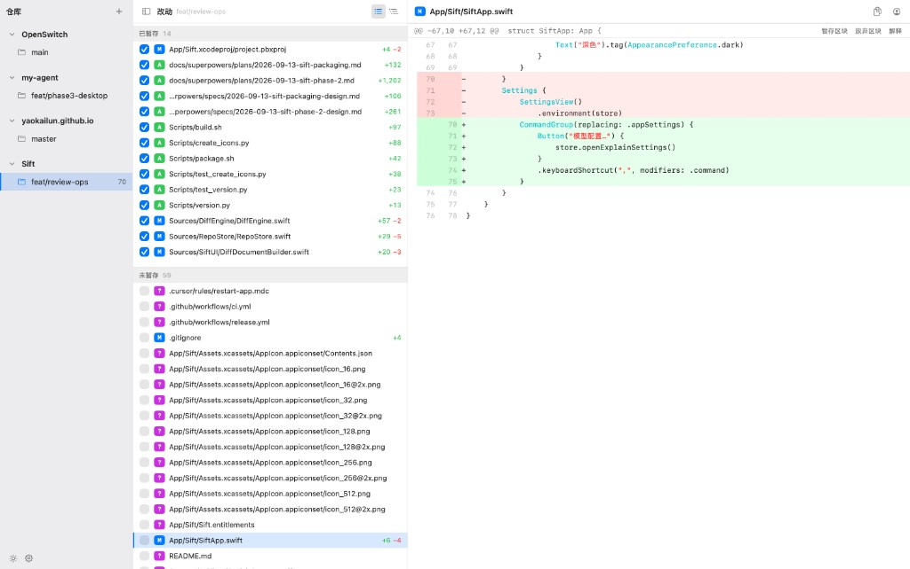

# Sift

[中文](README.md) · [English](README.en.md)

[](https://github.com/YaoKaiLun/Sift/actions/workflows/ci.yml)
[](https://github.com/YaoKaiLun/Sift/releases/latest)
[](https://www.apple.com/macos/)
[](LICENSE)

Sift is an open-source Git diff reader for macOS. It keeps multiple repositories and their worktrees in one sidebar, and focuses on file changes, unpushed commits, and actionable hunks. It is built for reviewing AI-generated or handwritten code changes.

Requires macOS 15 (Sequoia) or later.

The app follows the system language. Chinese is used when the preferred language starts with `zh`; otherwise the UI is English.



## Capabilities

- **Multiple repositories and worktrees**: Switch among repositories, the main working tree, and linked worktrees in one window.
- **File-level review**: Separate staged, unstaged, and untracked files. Supports list and tree views, plus staging or unstaging an entire file.
- **Hunk actions**: Stage, unstage, or discard a single hunk without leaving the app.
- **Unified and continuous diff**: Read a unified diff with line numbers and syntax highlighting, or scroll through every change in the current worktree.
- **File filters**: Hide images, tests, and other noise with glob rules.
- **Unpushed commits**: Inspect commits that are ahead of the upstream branch, while keeping the same file-level browsing model.
- **Images and large files**: Preview image diffs. Generated files and oversized files stay collapsed by default.
- **Blame**: Show line authors and commit info in single-file mode.
- **AI explain**: Send a selection or hunk to an OpenAI-compatible `/chat/completions` endpoint and stream an explanation.
- **Finder and code references**: The file list context menu can reveal the current file in Finder. A diff selection can be copied as a path-and-line code reference (`Cmd+Shift+C`) for pasting into other tools.
- **Stashes and worktrees**: Each repository can show a `stashes` group. Selecting a stash opens a read-only diff; the context menu can apply or drop it. Linked worktrees can be removed from the context menu; a dirty worktree is refused instead of force-deleted.
- **In-app updates**: Check GitHub Releases, download a new version, and restart to install after confirmation.

Sift is a review tool. It does not provide a commit graph, branch management, rebase, conflict resolution, push, or pull.

## Install

Download the latest `Sift-<version>.dmg` from [GitHub Releases](https://github.com/YaoKaiLun/Sift/releases/latest).

### Installer script

Open the DMG and double-click `Install Sift.command`. The script will:

1. Copy `Sift.app` to `/Applications`;
2. Remove the quarantine attribute added by a browser download;
3. Launch Sift.

If `/Applications/Sift.app` already exists, the script replaces it.

### Manual install

Drag `Sift.app` into Applications, then run:

```bash
xattr -cr /Applications/Sift.app
open /Applications/Sift.app
```

> [!IMPORTANT]
> Current releases use an ad hoc signature. They are not signed or notarized with an Apple Developer ID. macOS Gatekeeper may report that the app is damaged or that the developer cannot be verified. Download only from this repository's GitHub Releases, and remove the quarantine attribute after confirming the source.

## Quick start

1. Click `+` in the sidebar header and choose a Git repository. Worktrees under that repository appear automatically.
2. Select a worktree. The middle pane lists staged, unstaged, and untracked files.
3. Click a file to read its diff. Use the checkbox to stage or unstage the whole file.
4. Use the hunk header to stage, unstage, or discard that hunk. Deleting an untracked file asks for confirmation.
5. Use the up and down arrow keys to move among visible files. Hold `Shift` to extend the file selection.

The file list context menu can reveal the current file in Finder. Double-click opens it in the default app. In the diff pane, copy a selection as a path-and-line code reference, or press `Cmd+Shift+C`.

A `stashes` group appears after the worktrees when the repository has stashes. Select one to inspect a read-only diff; the context menu can apply or drop it. Linked worktrees can be deleted from the context menu; the main worktree cannot.

The funnel button in the middle pane configures file filters. Click Apply Filter to hide matches. When the button is selected, click it again to clear the filter.

The right pane supports single-file or continuous browsing, unified or split diff, and blame. Blame is unavailable in continuous mode.

## AI and privacy

AI explain is off by default. The first time Explain is used, fill in the endpoint, model, and API key under Model Settings:

- The endpoint must be compatible with OpenAI `/chat/completions`;
- The API key is stored in the macOS Keychain;
- No network request is sent until configuration is complete;
- Code and context are sent only when Explain or Explain Selection is clicked.

How the data is handled depends on the configured model service. Review that service's privacy policy before use.

## Local development

Development requires Xcode 26 or later and Swift 6.2 or later.

```bash
git clone https://github.com/YaoKaiLun/Sift.git
cd Sift
./Scripts/preflight.sh
```

`preflight.sh` runs the build, unit tests, and large-repository performance tests. You can also open `App/Sift.xcodeproj` in Xcode and run the `Sift` scheme.

Build and launch a Debug build from the command line:

```bash
xcodebuild \
  -project App/Sift.xcodeproj \
  -scheme Sift \
  -configuration Debug \
  -derivedDataPath /tmp/SiftBuild \
  -destination 'platform=macOS' \
  build
open /tmp/SiftBuild/Build/Products/Debug/Sift.app
```

## Packaging

Generating the app icon for the first time requires Pillow:

```bash
python3 -m pip install Pillow
./Scripts/build.sh
./Scripts/package.sh
```

- `build.sh` builds an ad hoc signed `dist/Sift.app`;
- `package.sh` writes `dist/Sift-<version>.dmg`;
- Pushing a `v*` tag makes GitHub Actions build the DMG and attach it to the matching Release.

## Contributing

Report issues or suggest features in [GitHub Issues](https://github.com/YaoKaiLun/Sift/issues).

Before sending a pull request, run:

```bash
./Scripts/preflight.sh
```

Pull requests should explain the purpose of the change, how it was verified, and any visible UI changes. For larger features or interaction changes, open an issue first to agree on scope.

## License

Sift is released under the [MIT License](LICENSE).
